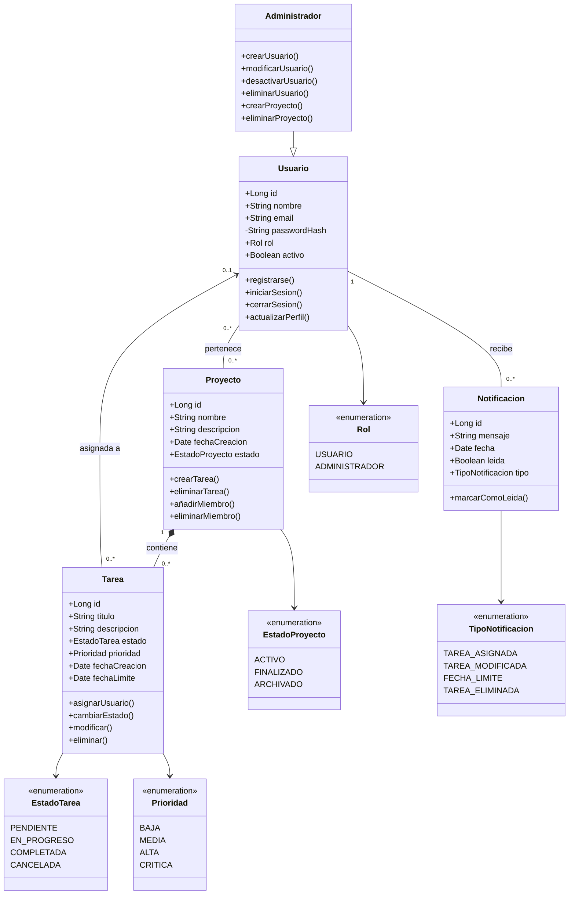

# Diagrama de clases

## Descripción de las clases

### Usuario

Representa a una persona registrada en el sistema.

Un usuario puede pertenecer a varios proyectos y un proyecto puede tener varios usuarios.

### Administrador

Es una especialización de `Usuario`. Hereda sus características y añade permisos para administrar usuarios y proyectos.

### Proyecto

Representa un proyecto dentro de la aplicación.

Un proyecto puede tener varios miembros y contiene cero o más tareas.

### Tarea

Representa una unidad de trabajo dentro de un proyecto.

Cada tarea pertenece a un único proyecto y puede estar asignada a un usuario.

### Notificacion

Representa un aviso generado por el sistema para un usuario, por ejemplo, cuando se le asigna una tarea.

### Enumeraciones

Las enumeraciones representan valores cerrados que pueden tomar determinados atributos:

* `Rol`: determina el nivel de acceso del usuario.
* `EstadoProyecto`: indica el estado de un proyecto.
* `EstadoTarea`: indica el estado de una tarea.
* `Prioridad`: establece la importancia de una tarea.
* `TipoNotificacion`: indica el motivo de una notificación.

## Relaciones principales

| Relación                        | Cardinalidad | Descripción                                                                               |
| ------------------------------- | ------------ | ----------------------------------------------------------------------------------------- |
| Administrador → Usuario         | Herencia     | Un administrador es un tipo de usuario.                                                   |
| Usuario ↔ Proyecto              | N:M          | Un usuario puede pertenecer a varios proyectos y un proyecto puede tener varios usuarios. |
| Proyecto → Tarea                | 1:N          | Un proyecto contiene varias tareas.                                                       |
| Usuario → Tarea                 | 1:N          | Un usuario puede tener varias tareas asignadas.                                           |
| Usuario → Notificación          | 1:N          | Un usuario puede recibir varias notificaciones.                                           |
| Usuario → Rol                   | N:1          | Cada usuario tiene un rol.                                                                |
| Proyecto → EstadoProyecto       | N:1          | Cada proyecto tiene un estado.                                                            |
| Tarea → EstadoTarea             | N:1          | Cada tarea tiene un estado.                                                               |
| Tarea → Prioridad               | N:1          | Cada tarea tiene una prioridad.                                                           |
| Notificación → TipoNotificacion | N:1          | Cada notificación tiene un tipo.                                                          |

